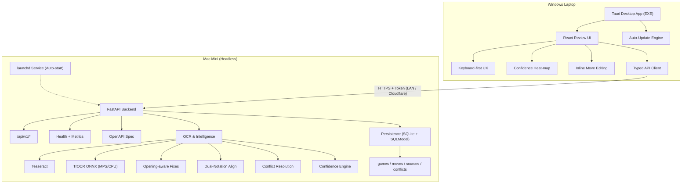
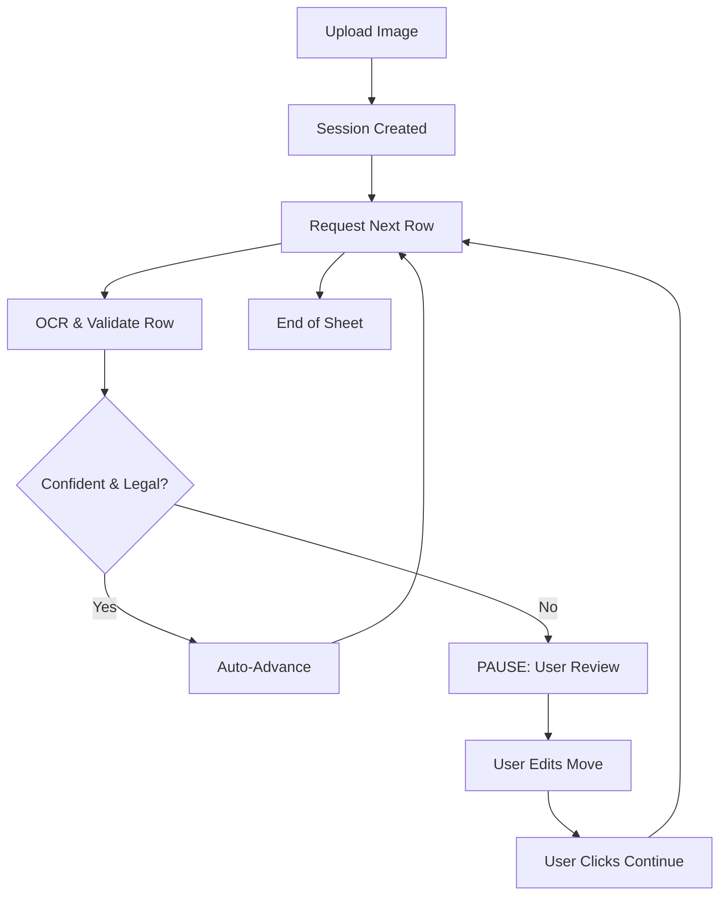

# Chess Notation OCR – V8 Distributed Deployment & Release Plan

**Version:** v8.0.0  
**Audience:** Developers, maintainers, release engineers  
**Goal:** Deliver a production‑grade, human‑in‑the‑loop chess notation OCR system with split frontend/backend, desktop distribution, and cloud‑ready networking.

---

## 1. Executive Summary

This document consolidates **everything discussed and implemented so far** into a **single, authoritative execution plan**.  
It is designed so that:

- Development can proceed **phase by phase without regressions**
- Frontend and backend can evolve **independently**
- Desktop users get a **single portable EXE**
- Backend runs **headless on a Mac Mini**
- LAN is supported today, **Cloudflare tomorrow**
- Releases are **automated, signed, and updatable**

This is not a concept note — it is an **implementation playbook**.

## 1.1 Non-Goals (v8)

The following are explicitly **out of scope** for v8:

- Multi-user authentication accounts
- Cloud-hosted backend (beyond Cloudflare tunnel)
- Mobile editing UI (capture only is post-v8)
- Distributed backend workers
- Engine analysis / Stockfish integration

These may be revisited post-v8.

---

## 2. Target Architecture (Final State)



### Key Properties
- Frontend = **stateless client**
- Backend = **single source of truth** (Sole owner of authoritative game data)
- Frontend holds **no canonical state**
- Network = LAN → HTTPS → Cloudflare Tunnel
- Updates = **automatic** (frontend)

---

## 3. Phase 0 – Repository & Branching Foundation

### Objectives
- Freeze v7 as reference
- Enable safe, incremental v8 work

### Actions
- Create `v8` branch
- Add `V8_BRANCH_PLAN.md`
- Update `README.md` with versioning policy

### Acceptance Criteria
- No code behavior changes
- CI still passes

---

## 4. Phase 1 – Core Chess Intelligence

### 4.1 Opening‑Aware System

**Purpose:** Improve OCR correction accuracy using chess knowledge.

#### Components
- ECO PGN loader
- Opening index with depth‑based matching
- Opening‑aware move correction

#### Key Files
- `backend/chess/openings/eco_loader.py`
- `backend/chess/openings/opening_index.py`
- `backend/ocr/merge.py`

#### Behavior
- Illegal OCR moves are *not blindly fixed*
- Corrections are preferred **only if opening‑consistent**
- All fixes are tagged (`opening_fix`) and reversible

#### Acceptance
- ECO PGN loads successfully
- Given SAN prefix → opening name
- Soft correction only

---

## 5. Phase 2 – Dual‑Notation Reconciliation

### 5.1 Data Model (Logical)

One game can have **multiple sources** derived from a **single mixed PDF**:
- **Source A** (e.g., Pages 1, 3, 5)
- **Source B** (e.g., Pages 2, 4)
- **Unassigned Pages** (Manual review needed)
- **Manual input**

Raw data is never destroyed. The system must support **dynamic source clustering** where the affiliation of a page (White vs. Black) is inferred, not hardcoded.

### 5.2 Move Alignment

#### Component
- `backend/reconcile/aligner.py`
- **New:** `backend/reconcile/cluster.py` (Page classification & grouping)

#### Responsibilities
- **Cluster Pages:** Group pages into opposing sources based on move heuristics (parity, range) and visual similarity.
- **Align Moves:** Align moves by ply across the identified clusters.
- **Tolerate Missing Metadata:** Do not rely on "White/Black" header fields.
- **Preserve Source Identity:** Trace every move back to its specific page and line.

### 5.3 Conflict Resolution

#### Component
- `backend/reconcile/conflict_resolver.py`

#### Rules
- All sources agree → auto‑accept
- Missing everywhere → unresolved
- Disagreement → conflict + reason

#### Output
- Reconciled move list
- Explicit conflict metadata

### 5.4 Physical Storage (SQLite)

#### Technology
- **SQLite** + **SQLModel** (SQLAlchemy wrapper)

#### Schema
- `games`: id, date, pgn_header
- `moves`: game_id, ply, san, fen, confidence
- `sources`: game_id, type (ocr/sheet), raw_data, **cluster_id (Source A/B)**
- `conflicts`: move_id, source_a, source_b, reason
- **New Table:** `page_clusters` (id, game_id, label, inferred_side, confidence)

#### Why SQLite?
- Zero-configuration (no Postgres docker required)
- Single file backup (`chess_ocr.db`)
- Sufficient for < 1M games
- ACID compliance for multi-source reconciliation

#### Database Migrations
- **Alembic**-style migrations
- Versioned schema upgrades
- Forward-only migrations for v8.x

---

## 6. Phase 3 – Confidence System

### Purpose
Provide **explainable trust signals** to humans.

### Inputs
- OCR legality
- Opening correction usage
- Conflict presence
- Number of agreeing sources

### Engine
- `backend/scoring/confidence.py`

### Output
- Per‑move confidence score (0–1)
- Propagated through entire pipeline

---

## 7. Phase 4 – Review UI (Human‑in‑the‑Loop)

### 7.1 Objective
Transform the UI into a modern, compact, and functional dashboard ("chess-in-one-ocr") that supports the full workflow from file upload to PGN export.

### 7.2 UI Design & Branding
- **Name:** `chess-in-one-ocr`
- **Style:** Modern Minimalist (Tailwind CSS).
- **Layout:**
    - **Idle State:** Focused "Hero" card for file upload.
    - **Review State:** Split-pane dashboard (Source Metadata vs. Move Review).

### 7.3 Functional Components

#### A. `FileUploader.jsx` (Compact)
- **Design:** Compact dropzone (`h-32` to `h-40`) to avoid consuming screen real estate.
- **Features:** Drag & drop, visual cues, supports PDF/Images.
- **Logic:** POST file to backend for asynchronous processing.

#### B. `ProcessingStatus.jsx`
- **Purpose:** Visual feedback during OCR/Analysis.
- **UI:** Progress bar with step descriptions (e.g., "Uploading", "OCR", "Reconciling").

#### C. `ReviewUI.jsx` (Lichess-style Notation)
- **Presentation:** Standard algebraic notation table.
    - **Columns:** Move Number | White Move | Black Move.
    - **Visuals:** Clean typography, row highlighting for current move.
- **Confidence Indicators:**
    - Color-coded dots (Green/Yellow/Red) next to moves.
    - Tooltips explaining confidence score.
- **Editing:**
    - Click any move to edit inline.
    - **Validation:** Immediate legality check against game state.
    - **Navigation:** Arrow keys to step through the game.

#### D. Interactive Chess Board
- **Visualization:** Integrated `react-chessboard` component.
- **Features:**
    - **Sync:** Updates automatically as user selects moves in the Score Sheet.
    - **Animation:** Visual feedback as moves are recognized/replayed.
    - **Playback:** Control buttons to replay the game sequence.

### 7.4 Move Validation Logic
- **Constraint:** Every move must be legal in the context of the game.
- **Mechanism:**
    - Maintain internal game state (using `chess.js` or similar in frontend).
    - **On Edit/Entry:** Validate move legality.
    - **Invalid Move:**
        - Prompt user: "Illegal Move. Please correct."
        - Prevent forward navigation until resolved.
        - Option to "Force" (but flag as invalid PGN).

---

## 8. Phase 5 – OCR Runtime (Production)

### Engines
- Tesseract (baseline)
- TrOCR ONNX (primary)

### Runtime Behavior
- Auto‑detect:
  - CUDA (NVIDIA)
  - MPS (Apple Silicon)
  - CPU fallback

### File
- `backend/ocr/trocr_engine.py`

---

## 9. Phase 6 – Distributed Deployment (Split Frontend / Backend)

### 9.1 Backend (Mac Mini)

#### Responsibilities
- OCR
- Reconciliation
- Confidence scoring
- PGN export
- **Health Reporting**: `/api/v1/health` (Alive check)
- **Metrics**: `/api/v1/metrics` (Queue depth, Latency, CPU)
- **API Spec**: `/openapi.json` for client generation

#### Runtime
- FastAPI
- Binds to `0.0.0.0:8000`
- Runs as macOS service (`launchd`)
- **Persistence**: SQLite `chess_ocr.db` in `~/Library/Application Support/ChessOCR/`

#### Auto‑Start
- `LaunchDaemon` plist
- Restarts on crash

#### Backend Updates
- **Strategy**: Git-based pull + service restart
- **Script**: `update_backend.sh`
  1. `git pull origin v8`
  2. `pip install -r requirements.txt`
  3. `brew services restart chess-backend`
- Triggered manually via SSH or simple UI admin action

---

### 9.2 Frontend (Windows)

#### Responsibilities
- Review UI
- Human corrections
- Export

#### Technology
- React + Tauri

#### Result
- Single portable EXE
- No browser chrome
- No Python / Node at runtime

---

## 10. Phase 7 – Networking & Security

### 10.1 LAN Discovery
- mDNS (`chess-backend.local`)
- Fallback IP scan

### 10.2 Authentication & Pairing

#### Initial Pairing Flow
1. **First Run (Frontend)**: User prompted for Backend IP (or auto-discovered).
2. **Handshake**: Frontend requests pairing code.
3. **Verification**: User sees 6-digit code on backend logs/screen (Mac Mini) and types it into Frontend.
4. **Token Generation**: Backend generates long-lived `X-API-TOKEN`.
5. **Storage**: Frontend saves token in `tauri-store` (encrypted).

#### Requests
- All subsequent requests send `X-API-TOKEN` header.

### 10.3 API Contract (OpenAPI)
- **Source**: Backend generates `openapi.json` from FastAPI models.
- **Client**: Frontend uses `openapi-typescript-codegen` to generate typed API client.
- **Benefit**: Compile-time errors if Backend/Frontend diverge.

### 10.4 HTTPS
- Self‑signed cert for LAN
- Full HTTPS behind Cloudflare

### 10.5 Networking & Security Overlay

```mermaid
graph TD
    subgraph Frontend
        FE_Discover[Auto-discover backend: mDNS / scan]
        FE_Pair[Pairing handshake: one-time]
        FE_Token[X-API-TOKEN: long-lived]
        FE_HTTPS[HTTPS]
        FE_Pin[Certificate pinning]
    end

    subgraph Backend
        BE_Health[/api/v1/health]
        BE_Spec[/openapi.json]
        BE_Auth[Token validation]
        BE_Tunnel[Cloudflare tunnel: optional]
    end

    FE_Discover -.-> BE_Health
    FE_Pair -.-> BE_Auth
    FE_Token -.-> BE_Auth
    FE_HTTPS == Encrypted ==> BE_Auth
```

### 10.6 Use Case: Run Frontend Locally (Development)
Developers may need to run the full stack on a single machine (e.g., MacBook Air).
- **Backend**: Runs on `localhost:8000` via `uvicorn`.
- **Frontend**: Runs on `localhost:3000` via `npm run tauri dev`.
- **Config**: Frontend detects `localhost` and bypasses mDNS discovery.
- **Data**: Uses local SQLite db in `~/.chess-ocr-dev/`.

---

## 11. Phase 8 – Desktop Distribution & Auto‑Update

### 11.1 Tauri Auto‑Update
- Enabled in `tauri.conf.json`
- Triggered on GitHub releases

### 11.2 GitHub Actions (Windows)

#### Workflow
- `.github/workflows/windows-tauri-release.yml`

#### Trigger
- `git tag vX.Y.Z`

#### Steps
1. Checkout code
2. Install Node + Rust
3. Build React
4. Build Tauri EXE
5. Sign EXE (GitHub Secrets)
6. Upload artifact

---

## 12. Phase 9 – Cloudflare Readiness

### Command (One‑Line)
```bash
cloudflared tunnel --url https://localhost:8000
```

### Frontend Change
```ts
backendBaseUrl = "https://xxxx.trycloudflare.com";
```

No rebuild required.

---

## 13. Phase 10 – End‑to‑End Interactive Flow (v8.1)

### 13.1 Stepwise Processing Logic
Instead of a "batch and pray" approach, v8.1 introduces **Interactive Session Processing**:

1.  **Session Start:** User uploads file → Backend creates session ID + segments grid rows.
2.  **Row-by-Row Loop:**
    *   Frontend requests `POST /api/v1/session/{id}/process_next`.
    *   Backend processes *one row* (e.g., 2-4 moves).
    *   Backend returns moves + confidence + crop image.
3.  **Human Intervention:**
    *   **High Confidence:** Frontend auto-advances to next row (500ms delay).
    *   **Low Confidence / Illegal:** Frontend **PAUSES**.
    *   User sees the specific row crop, fixes the move, and clicks "Continue".



### 13.2 Failure Handling

Explicitly defined failure modes:

- **Clustering Ambiguity:** If system cannot split pages into 2 clear sources, flag all pages as "Unassigned" and require human drag-and-drop grouping.
- **OCR Failure**: Move marked unresolved, confidence `0.0`, requires manual entry.
- **Opening Mismatch**: No forced correction; raw OCR output preserved.
- **Backend Unreachable**: Frontend enters "Offline Mode" (read-only or local cache).
- **Token Invalid**: Re-pairing flow triggered immediately.
- **SQLite Corruption**: Restore from single-file backup (`.bak` generated daily).

---

## 14. Definition of Done (v8)

✔ Opening‑aware correction  
✔ Dual‑player reconciliation  
✔ Confidence‑driven UI  
✔ Keyboard‑first review  
✔ Signed desktop EXE  
✔ Auto‑update enabled (Frontend)  
✔ Script‑based update (Backend)  
✔ LAN + Cloud‑ready backend  
✔ SQLite Persistence Layer  
✔ Typed API Client  
✔ **New:** Compact, Branded UI ("chess-in-one-ocr")  
✔ **New:** Lichess-style Notation View  
✔ **New:** Inline Move Validation  
✔ **New:** Interactive Chess Board & Animation  
✔ **New:** Interactive "Row-by-Row" Processing Mode  

---

## 15. Post‑v8 Roadmap (Optional)

- Model fine‑tuning from human corrections
- Mobile capture client
- Tournament bulk ingestion
- User roles & audit logs
- Cloud multi‑tenant mode

---

**END OF DOCUMENT**
